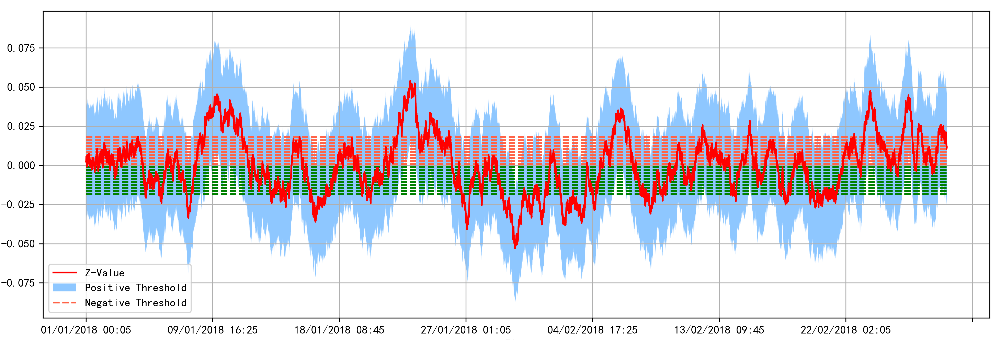
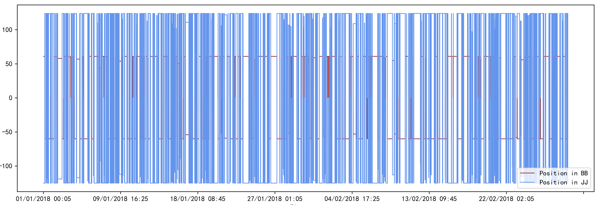
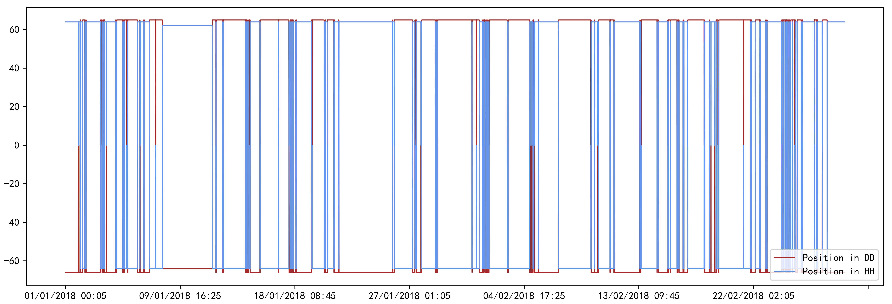
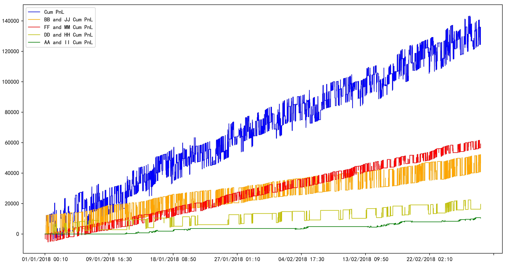
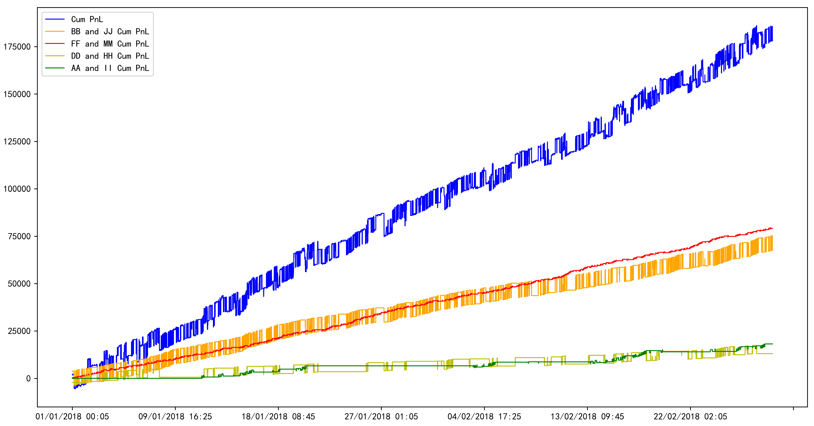

# Statistical-Arbitrage
In this project we provide a backtesting pipeline for intraday statistical arbitrage. Both traditional spread models (i.e. pairs trading with cointegration tests, time series analysis) and continuous time trading models (i.e. Ornstein-Uhlenbeck process) are used to model the spread portfolios.

## Scripts
- `data`: intraday data files, including stocks, options, and dual listing stocks
- `utils`: arbitrage tool functions including cointegration tests and regression analysis
- `models`: simulations and parameter estimations for stochastic models and option greeks
  - `BM.py`: brownian motion related functions
  - `Vasicek.py`: OU-process related functions
  - `BS_model.py`: Black-Scholes model and option greeks
- `statistical_arbitrage`: notebook for realizing pair trading based on limit orderbook stock data
- `res`: results for positions, thresholds, and PnLs

## Backtesting
#### Spread Portfolios

#### Threshold Analysis

#### Position Analysis

#### PnL Visualization

## Note
- Higher the transaction costs, larger the optimal entry points for arbitrage, lower the trading frequency.
- Sensitivity analysis needs to be conducted with respect to the level of transaction costs (price impact, bid-ask spread, and commission fees).
